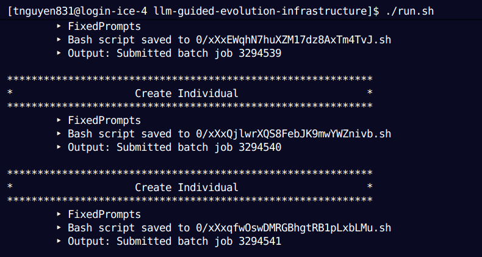

.. LLM-GE documentation master file, created by
   sphinx-quickstart on Mon May  5 22:08:05 2025.
   You can adapt this file completely to your liking, but it should at least
   contain the root `toctree` directive.

Setting up LLM-GE and run on CIFAR-10
=======================================

Overview
--------

This page provide general set-up to run LLM-GE using local LLM models. This document supports both UV (fast with python packages) and Conda. 

Code Base - Setup
-----------------

1. **Install Required Tools**

- `VS Code`
- `OpenSSH <https://www.openssh.com/>`_ (usually preinstalled on macOS and Linux)
- On Windows: Install `Git for Windows <https://git-scm.com/>`_ or enable 
    *OpenSSH Client* in *Windows Features*.

2. **Install the Remote Development Extension Pack**

- Open VS Code.
- Go to **Extensions** (Ctrl + Shift + X or Cmd + Shift + X on macOS).
- Search for *“Remote Development”* and install the official Microsoft extension pack.

3. **Opening ICE in VS Code**

- Press **F1** or **Ctrl+Shift+P** to open the Command Palette.
- Type and select: ``Remote-SSH: Connect to Host...``
- Type ``<username>@login-ice.pace.gatech.edu`` to the query box. Replace ``<username>`` with your GT username (e.g., *tnguyen831*). Enter your GT account's password.
    
**Once connected, you can:**

- Browse and edit files in your ICE home directory.
- Open terminals directly on the ICE cluster.
- Use installed compilers, Python environments, or UV/Conda environments.

**Note:** 

You can connect to ICE via terminal:

.. code-block:: bash

    ssh <username>@login-ice.pace.gatech.edu

Large Language Model Guided Evolution (LLMGE) Repository
------------------------------------------------

Overview
^^^^^^^^
This unique framework is based off of Morris, Jurado, and Zutty's research paper called, “The Automation of Models Advancing Models”. They were able to create a framework that uses LLMs with a layer of creativity to speed up the process of evolving ML models, specifically for ExquisiteNetV2.

ExquisiteNetV2 is a lightweight CNN designed for image classification, tested on 15 datasets \(CIFAR-10, MNIST\) with 518,230 parameters, achieving 99.71% accuracy on MNIST. 

Clone Repository
^^^^^^^^^^^^^^
In VS Code's terminal, type:

.. code-block:: console

    git clone https://github.com/jasonzutty/llm-guided-evolution-fork.git

LLM-GE Codebase Structure
^^^^^^^^^^^^^^^^^^^^^^^^^
.. image:: point_cloud_resources/repo-structure.png

Setting up the Python Environment
^^^^^^^^^^^^^^^^^^^^^^^^^^^^^^^^^
Once the repository is cloned onto PACE ICE, create and activate a virtual environment using one of the two following ways:

- **UV**: 

    1. **Download UV:**
    
    - Visit the installation page: `https://docs.astral.sh/uv/getting-started/installation/`

    2. **Navigate to the Project Root Directory:**
    
    - Ensure you are in the folder that contains ``pyproject.toml``.

    3. **Run the following commands:**

    .. code-block:: bash

        uv venv
        uv sync

- **Conda**:

    1. **Open the environment file:**

    .. code-block:: bash

        nano environment.yml

    2. **Create the Conda environment:**

    .. code-block:: bash

        conda env create -f environment.yml

    3. **Activate the environment:**

    .. code-block:: bash

        conda activate llmge-env

    4. **Verify the environment packages:**

    .. code-block:: bash

        conda list

    - This command lists all installed packages and confirms that the environment was created successfully.

Testing and Data Preparation
----------------------------
1. **Download the training dataset:**

- `https://github.com/jasonzutty/llm-guided-evolution-fork/blob/vip-docs-second-rebase/sota/ExquisiteNetV2/README.md`

2. **Download CIFAR-10 (Python version)** into your root directory.

.. code-block:: bash 

    wget https://www.cs.toronto.edu/~kriz/cifar-10-python.tar.gz

3. **Move or copy ``split.py``** from ``sota/ExquisiteNetV2`` into the project root, then run:

    .. code-block:: bash

        uv run split.py

4. **Your directory structure should look like this:**

    .. code-block:: text

        llm-guided-evolution-Island-Migration/
        ├── cifar10/
        │   └── [...]
        ├── sota/ExquisiteNetV2/
        │   └── [...]
        ├── src/
        │   └── [...]
        └── [...]

Configuration
-------------
Edit configuration files to match your ICE directory paths and experiment settings.

**Key files to update:**

- ``src/cfg/constants.py``
- ``run_improved.py``
- ``run.sh``

**Example modification in ``run_improved.py`` (line 230):**

.. code-block:: python

    def check4job_completion(job_id, local_output=None, check_interval=60, timeout=3600*3):  # 3600*3

**In ``src/cfg/constants.py``**, ensure you set the following variables appropriately:

.. code-block:: python

    LOCAL = False
    INFERENCE_SUBMISSION = False

Make sure the root directory is set to PACE ICE paths. For example:

.. code-block:: python

    ROOT_DIR = "/home/hice1/tnguyen831/scratch/llm-guided-evolution-infrastructure"

Note that the default BASH scripts is configured to use Conda, so if you use Conda, don't change anything. 

Otherwise, here is the modified BASH scripts if you want to use **UV**, and remember to include the `HF_HOME` - environment variable.

**Example: PYTHON_BASH_SCRIPT_TEMPLATE**

.. code-block:: bash

    #!/bin/bash
    #SBATCH --job-name=evaluateGene
    #SBATCH -t 8:00:00
    #SBATCH --gres=gpu:1
    #SBATCH -C "A100-40GB|A100-80GB|H100|V100-16GB|V100-32GB|RTX6000|A40|L40S"
    #SBATCH --mem-per-gpu 16G
    #SBATCH -n 12
    #SBATCH -N 1
    echo "Launching Python Evaluation"
    hostname

    module load cuda
    export HF_HOME=/storage/ice-shared/vip-vvk/llm_storage/

    # Run Python script
    uv run {}

**Example: LLM_BASH_SCRIPT_TEMPLATE**

.. code-block:: bash

    #!/bin/bash
    #SBATCH --job-name=llm_oper
    #SBATCH -t 8:00:00
    #SBATCH --gres=gpu:1
    #SBATCH -C "{}"
    #SBATCH --mem-per-gpu 16G
    #SBATCH -n 12
    #SBATCH -N 1
    echo "Launching AIsurBL"
    hostname

    module load cuda
    export HF_HOME=/storage/ice-shared/vip-vvk/llm_storage/

    uv run {}

Running the Experiments
-----------------------
Similarly, if you choose to run with Conda, you don't need to change anything.

Otherwise, if you choose to run with UV, comment out any ``conda`` lines in ``run.sh`` and replace them with ``uv run``.  
Also, ensure ``HF_HOME`` is exported before executing the run command.

**Example: run.sh**

.. code-block:: bash

    # module load anaconda3
    export CUDA_VISIBLE_DEVICES=0
    export HF_HOME=/storage/ice-shared/vip-vvk/llm_storage/

    # conda activate llm_guided_env
    # export LD_LIBRARY_PATH=~/.conda/envs/llm_guided_env/lib/python3.12/site-packages/nvidia/nvjitlink/lib:$LD_LIBRARY_PATH
    # conda info

    uv run run_improved.py first_test

To execute a run, simply call:

.. code-block:: bash

    ./run.sh

A successful run should look like this:

Clean Up
-----------------------

To perform clean up (starting running LLMGE again from scratch), run:

.. code-block:: bash
    
    ./cleanup.sh

Notes
-----
- Please confirm that environment variables and paths are correctly set before running experiments.
- GPU types can vary; if a specific GPU type is unavailable, SLURM will automatically queue your job.
- For troubleshooting or queue monitoring, refer to the PACE documentation:  
    - `https://pace.gatech.edu/`